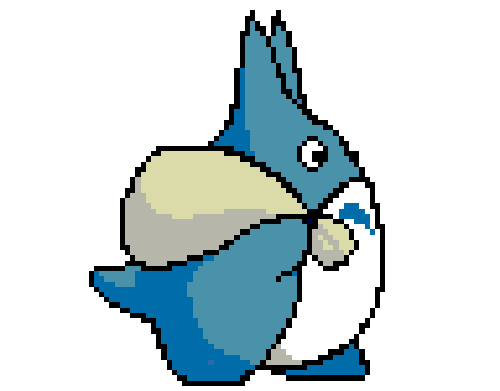

<!-- COLOR PALETTE: https://colorhunt.co/palette/155263ff6f3cff9a3cffc93c
Background: 155263
Icons: FF6F3C
Icons: FF9A3C
Title: FFC93C
Text: e6eef0

-->

<h1 align="center"> Hi there 👋, I'm Jaime Alba</h1>

<!--- animated text, to copy, just replace the lines with your choice or visit https://readme-typing-svg.herokuapp.com --->

Originally from Spain, I am now studying in the south-west of France.  
I'm a [Polytech Nice-Sophia](https://polytech.univ-cotedazur.fr/) student pursuing a career in **<b style="color:#FF6F3C">Autonomous Robotic Systems</b>**.  
My two years of Polytech's intensive preparatory cycle culminated in a national ranking of **27th** out of 1567 students.

 

<!-- https://github.com/durgeshsamariya/awesome-github-profile-readme-templates/blob/master/AVS1508.md -->

 

## 📊 &nbsp;Github Stats

 

 

## 👨‍🎓 &nbsp;About Me

- 🏫&nbsp;I am currently learning `.c`
- ⭐&nbsp;My favorite languages are `.java` , `.py` and `.c`
- ♟️&nbsp; We can connect on [Chess.com](https://www.chess.com/member/Surfer732) or [Lichess.org](https://lichess.org/@/Jaime_AP) to play some games
- 🌐&nbsp;I speak fluent English, Spanish and French

 
 

